[toc]


# IPC即插即用功能介绍

## 1. 背景介绍
### 1.1 文档简介
本文档是以沙特城际公交大巴项目为示例背景，集中讲解公交行业IPC摄像头即插即用相关的功能。

### 1.2 沙特项目系统构成图

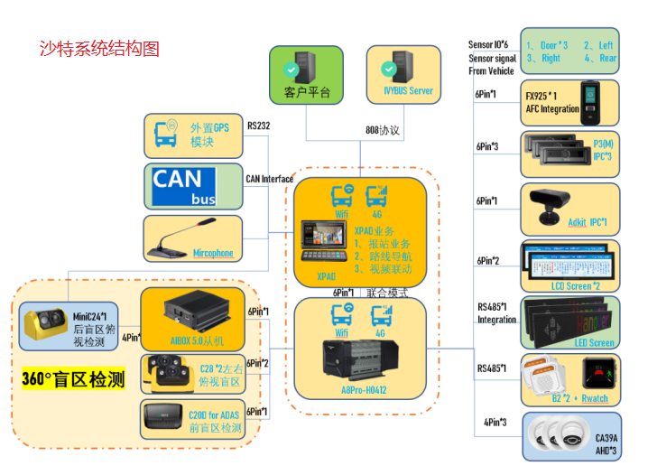

#### 1.2.1 系统组成：   
主机:  XPAD
MDVR: A8Pro-H0412 (注意：支持4路AHD和12路IPC)
AHD:  CA39A*3 
IPC:  AIbox5.0从机-MiniC24(ipc*1) + C28*2(ipc*2) + C20D(ipc*2) + P3(主)*3(ipc*3)+ ADKit(dsm) (ipc*1) + 28.5寸LCD屏(IPC*2) + AFC*1(IPC*1)（客户指定）  

其他外设：IO Sensor*6 + 鹅颈麦克风 + RWatch（485） + LED屏（485-车厂提供）
平台：IVYBUS平台

IPC外设供占据12路IPC,我们的A8Pro-0412的IPC也只有12路接口；

### 1.3 系统连接图

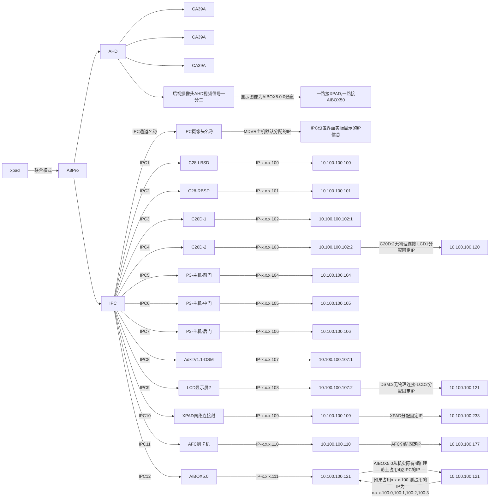

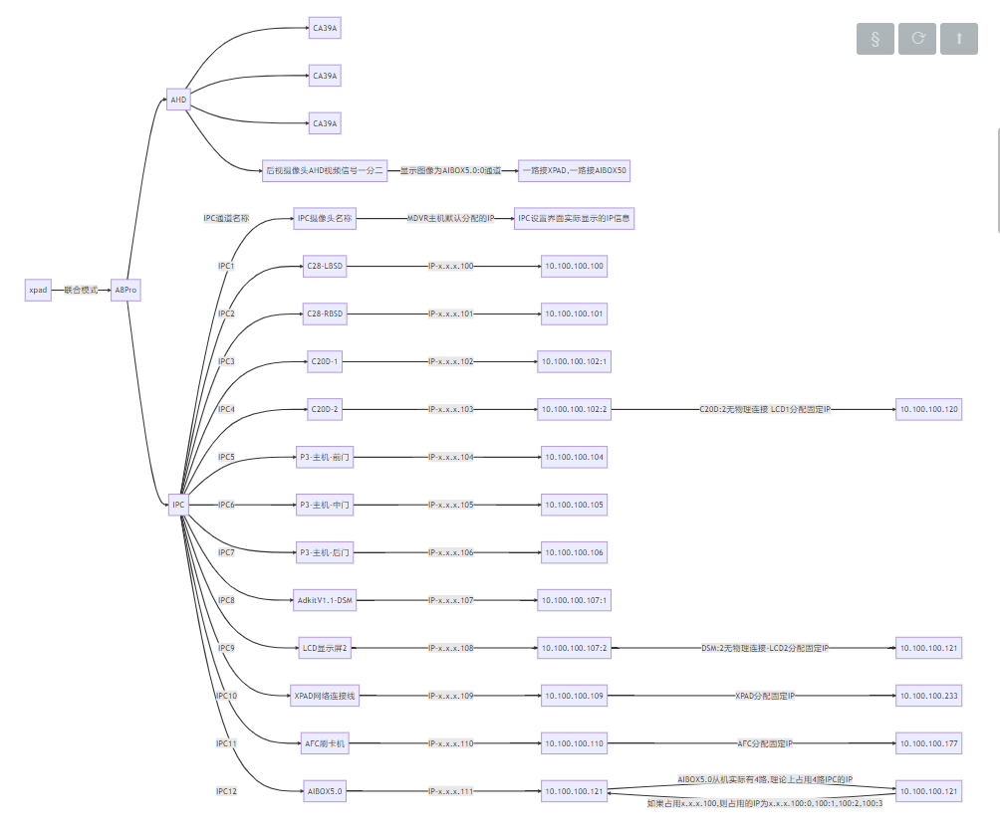


## 2. IPC即插即用基本原理

### 2.1 系统构成分析
2.1.1 XPAD-A8PRO联合模式当中，XPAD是作为主机，A8PRO作为从机使用，其中公交相关报警，业务调度等都位于XPAD进行管理，A8PRO本质作为录像存储介质和交换机使用，但是与IPC的IP分配相关的业务都位于MDVR,  故该系统可以作为公交典型的MDVR+IPC构成的**单机模式**进行分析。  

2.1.2. 由系统构成图可知,物理接口上所有的IPC都是接在MDVR的IPC口，软件上IP的分配由A8PRO进行管理。

2.1.3.  本文介绍IPC的即插即用功能，故需要软件层面启用IPC即插即用功能；

### 2.2 IP分配原理

以0412机型为例，1-2-3-4通道为AHD通道，5-6-7-8-9-10-11-12-13-14-15-16通道为IPC通道

#### 2.2.1. IPC即插即用的摄像头IP分配原理：
   5通道对应IPC的物理接口的第一路通道，MDVR主机默认分配的IP为  10.100.100.100
   6通道对应IPC的物理接口的第二路通道，MDVR主机默认分配的IP为  10.100.100.101
   ...
   16通道对应IPC的物理接口的第二路通道，MDVR主机默认分配的IP为  10.100.100.111
   
   综上：当有摄像头接入到MDVR主机时,系统会默认的给IPC分配一个IP，而这个IP地址和它实际的物理接口有关系；

   所以，你只需要确认机型(如：0804机型，0808机型，0412机型)等，然后从IPC的第一个接口开始往下数，就知道在无任何手动干预的情况下，系统给IPC摄像头分配的IP是多少了。

#### 2.2.2. IPC是单路的摄像头的IP分配：
   例如：普通的非只能摄像头
  如果接入主机的所有的IPC摄像头都是一路的，那么对应的IPC摄像头的IP分配遵循第一条；
  这里以A5H-0404机型举例(系统构成：AHD\*4,IPC\*4)，查看对应的IPC摄像头的IP信息：

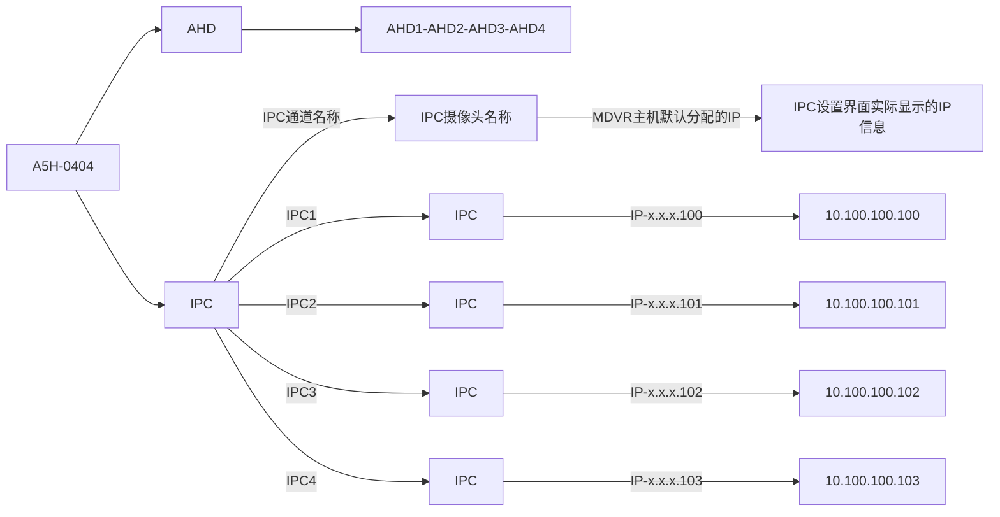

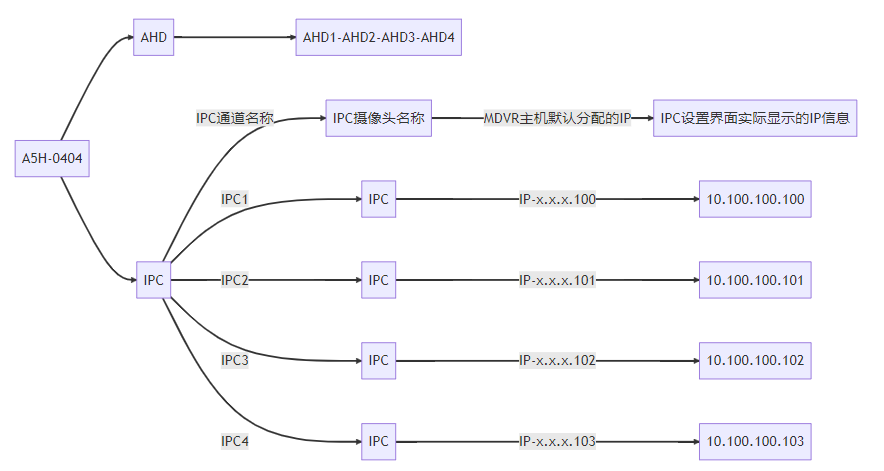

  
  可以看到，对应的普通IPC摄像头的IP为10.100.100.100, 10.100.100.101,10.100.100.102,10.100.100.103

#### 2.2.3. IPC是多路的摄像头的IP分配-Adkit-C20D：
  - 示例：我们常用的DSM摄像头和C20D摄像头 **-显性**
  - 典型的：Adkit1.1和C20D摄像头，都只有1路的物理IPC接口，但是实际的码流通道却有两条,所以在即插即用的场景下占用的IP是两路,且对应的IP后加:1，:2区分；
  假设DSM接入IPC2通道，则分配的IP是10.100.100.101,
  那么对应的Adkit1.1或C20D的IP分配为 10.100.100.101:1和10.100.100.101：2；
  这里仍以A5H-0404机型举例(系统构成：AHD\*4,IPC\*2+DSM+ADAS)，查看对应的IPC摄像头的IP信息：

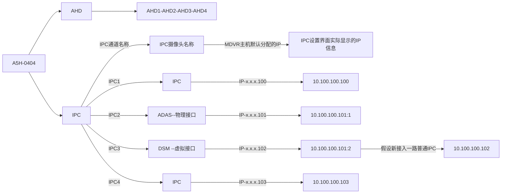

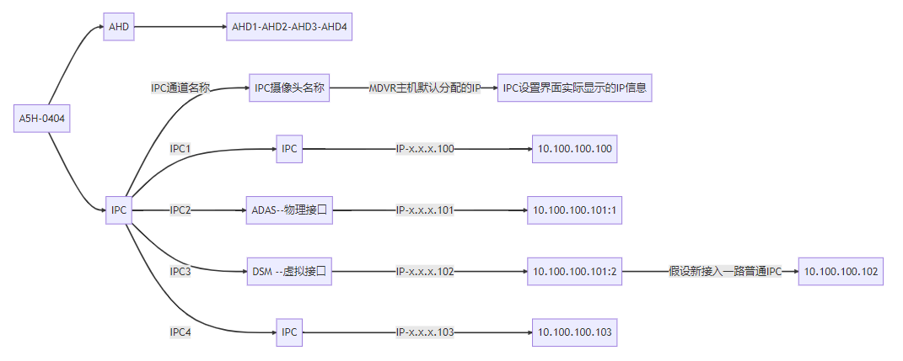


  - 可以看到，对应的Adkit1.1智能摄像头的ADAS通道是实际接入的物理接口IPC,且对应的DSM占用的虚拟端口IPC3，
  虽然IPC3没有物理接线，但是必须空出来；

  - 假设IPC3口接入了一路普通的IPC摄像头，那么在启动即插即用的情况下，MDVR主机会给普通的IPC摄像头分配IP-10.100.100.102，同时当Adkit启动后也会给DSM通道分配IP-10.100.100.101:2，就会导致IP冲突，导致IPC3口要么普通IPC不出图，要么DSM通道不出图；
  
  - 所以对于多路的摄像头要特别注意，不能因为对应的物理接口未接线，就想着多接一路IPC，这样是不对的；


#### 2.2.4. IPC是多路的摄像头的IP分配-AIBOX5.0从机：
  - 示例：多路从机AIBOX5.0，占用4路IPC的IP-**显性**
  - 典型的：AIBOX5.0的从机和Adkit,C20D类似
  
  - 机型假设是A8PRO-0808H,假设AIBOX5.0从机接入IPC2通道，则物理通道分配的IP是10.100.100.101,
    那么对应的AIBOX5.0的其他通道的IP分配为 10.100.100.101:1, 10.100.100.101:2 ,  10.100.100.101:3, 10.100.100.101:4；
    那么你在考虑摄像头接入的时候就需要考虑接入的顺序，以防止IP冲突的问题产生；

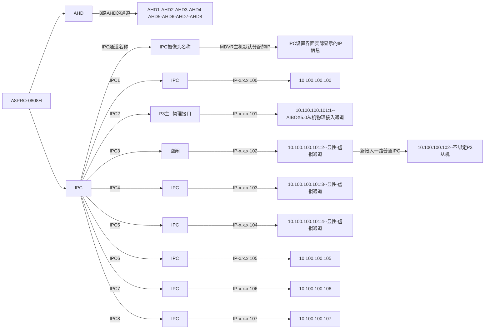

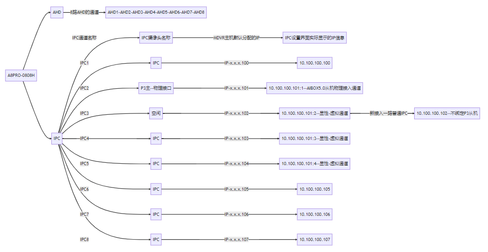


  - 可以看到，对应的AIBOX5.0从机智能摄像头的1通道是实际接入的物理接口IPC2,默认绑定和占用4路IPC端口，可以认为从物理接入通道后的4路IPC口是被占用的(显性)。

  - 所以假设你现场需要在IPC3-IPC4-IPC5通道接入其他摄像头，且你的AIBOX5.0只接入了一路,那么考虑到即插即用情况下的IP冲突问题，你的AIBOX5.0的第一路物理通道最好能往后放；
  - 接入示例：
    - 如果AIBOX5.0从机仅接入一路，且是第一路，则建议将AIBOX5.0的物理IPC接入放到IPC8,
    - 如果AIBOX5.0从机接入2路，比如第1,2路，同理可以将AIBOX5.0的物理IPC接入放到IPC7,
    - 如果AIBOX5.0从机接入3路，且是1,2,3路，则可以将AIBOX5.0的物理IPC接入放到IPC6,
    - 如果AIBOX5.0从机接入4路，则可以将AIBOX5.0的物理IPC接入放到IPC5,
  - 
    - 如果AIBOX5.0从机仅接入一路，且是第2路，你需要注意下，第一路需要空出来，也就是至少需要两路，可以将AIBOX5.0的物理IPC接入放到IPC7,

  - 如果最终无法将AIBOX5.0放到后面的通道，则需要考虑即插即用场景下的IP冲突问题；


#### 2.2.5. IPC是多路的摄像头的IP分配-P3：
  - 示例：我们常用的P3客流仪-**隐性**
  - 典型的：P3客流仪分为主机和从机，从机可以接入也可以不接入，按摄像头类型分配，归于APC客流仪类型但可以出图和录像；
  
  - 在从机接入的情况下，有两路码流；
  在从机未接入的情况下，只有一路码流；
  虽然在启用即插即用的场景下占用的IP是两路,且对应的IP后加:1，:2,但是本质上是作为APC使用,默认不绑定IPC，
  **所以在使用的时候需要我们手动搜索绑定到IPC通道；**
  
  - 假设P3接入IPC2通道，则分配的IP是10.100.100.101,
  那么对应的P3的IP分配为 10.100.100.101:1和10.100.100.101：2；
  但是由于P3默认不绑定IPC通道，所以可以这样认为，MDVR主机给P3客流仪分配了IP,但是我还未启动该IP,当切仅当我将对应的P3的IP绑定到对应的通道上时,该IP才被启用：

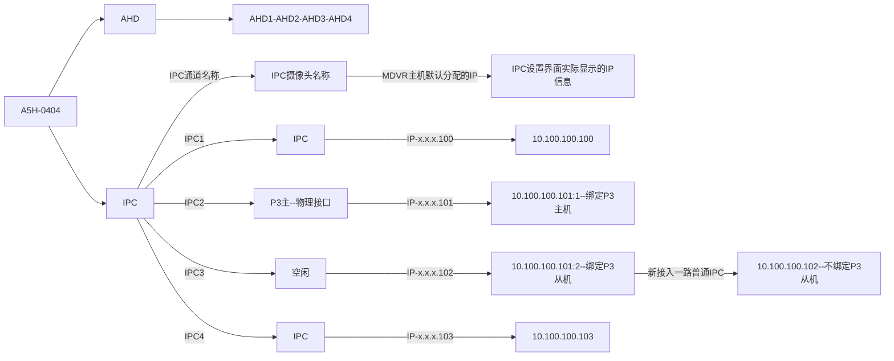

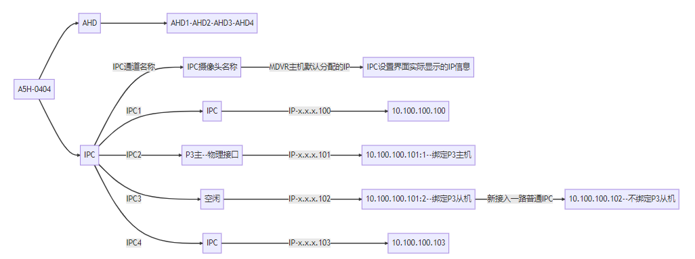

  - 可以看到，对应的P3智能摄像头的1通道是实际接入的物理接口IPC2,虽然在搜索P3的时候可以看到对应的10.100.100.101:2,但是由于未绑定对应的IPC口,所有可以认为该IPC口是未被占用的，
  你可以这样认为：**C20D的两个通道都是显性的，都占用对应的IPC口的IP，但是P3的两个通道都是隐性的，只有当你绑定到对应的IPC上时才占用该IP**。

  - 所以假设IPC3口接入了一路普通的IPC摄像头，那么在启动即插即用的情况下，MDVR主机会给普通的IPC摄像头分配IP-10.100.100.102，
  由于P3需要手动绑定，如果只绑定主机的情况下不会导致IP冲突，IPC3口不受影响；
  如果同时绑定主机和从机，则MDVR会给P3的从机分配IP-10.100.100.101:2，情况同DSM通道，会IP冲突，导致IPC3口要么普通IPC不出图，要么DSM通道不出图；
  


#### 2.2.6. 联合模式XPAD-A8PRO扩展分析：

XPAD-A8PRO联合模式下，XPAD作为主机，A8PRO作为从机使用；
XPAD有自己独立的IP,这里假定为10.100.100.233

  - 假设P3接入IPC2通道，则默认分配的IP是10.100.100.101,
  - 这里我们将XPAD作为A8PRO的一路IPC进行分析，在XPAD接入A8PRO主机后，系统会给XPAD进行IP分配


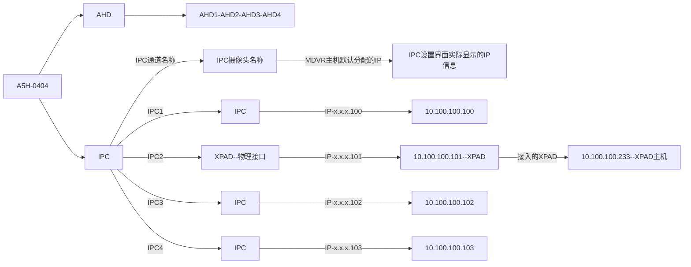

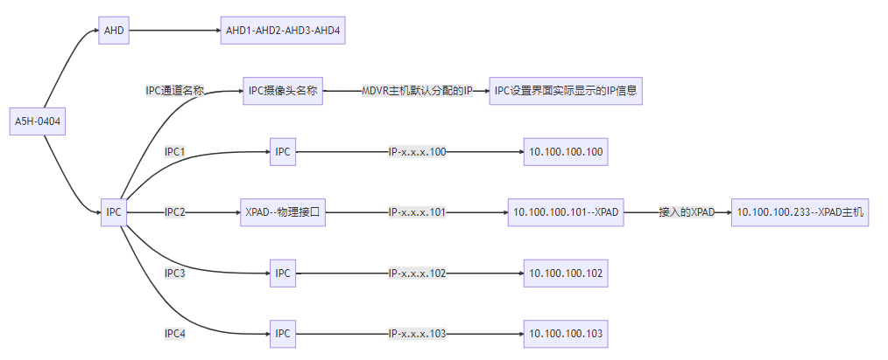


这里在实际场景下遇到的问题是：
XPAD后启动，A8PRO先启动，多数场景下正常；
XPAD先启动，A8PRO后启动，概率性出现XPAD主机的IP被A8PRO重新分配，切分配的IP为对应的物理通道的IP： 10.100.100.101;
从而导致A8PRO从机做客户端连接XPAD主机失败，导致XPAD和A8PRO断开连接；
所以在A8PRO启用即插即用的场景下，需要对XPAD的IP进行过滤，防止IP被重置；


#### 2.2.7. 外设LCD和AFC刷卡机：

- LCD显示屏本身是Android系统，IP不会被重新分配；
  AFC刷卡机外设的IP管理独立，IP也不会被重新分配；
  所以他们的位置可以放在对应的多路摄像头的虚拟接口上，比如Adkit的DSM通道，C20D的第2路通道等等；

  同时还需要考虑到网络通信，所以可以考虑给LCD和AFC刷卡机分配固定的IP,且分配的固定的IP是不能被即插即用占用到的，
  以A8PRO-0412为例，即插即用可以分配的IP为： 10.100.100.100,101,102,103,104,105,106,107,108,109,110,111
  所以LCD可选IP: 10.100.100.120, 10.100.100.121
  所以AFC可选IP: 10.100.100.177
  

#### 2.2.8. 系统连接图接线分析：
  如果你能看到这里，那么请你回头看一下章节1.3的系统连接图，如果你能看懂，那么对应的即插即用的基本注意事项应该没有问题了；

  对章节1.3系统连接图简单分析：

  - IPC1,IPC2单路摄像头，参考章节 **2.2.2. IPC是单路的摄像头的IP分配**,
  IPC3,IPC4, C20D摄像头的物理接口占用IPC3一路，C20D显性占用两路IP，则IPC4不能接摄像头,否则会导致IP冲突，这里我们将 LCD显示屏(网口外设，IP不会被修改)接入到IPC4;

  - IPC5,IPC6,IPC7,仅接入了P3主机,P3默认不绑定IP,但是A8PRO主机会给P3分配IP,所以需要我们手动绑定,这里我们仅绑定了P3的主机通道；比如IPC5通道，你手动搜索P3时要注意，对应的IP是10.100.100.104, IPC6是10.100.100.105 ... 不要将10.100.100.15搜索到IPC5通道上,否则重启后对应通道的图像会丢失；

  - IPC8,IPC9,Adkit我们接入了IPC8,对应的和C20D的使用注意事项一致,物理接口接入了IPC8,对应的IPC9不接摄像头,可以接LCD2；

  - IPC10接入XPAD, 这里需要A8PRO即插即用过滤XPAD的IP,防止对XPAD进行IP再分配；

  - IPC11接刷卡机,
  IPC12接AIBOX5.0从机, 仅使用了AIBOX5.0从机的第一路MiniC24；

  - 如果AIBOX5.0从机需要使用到对应的第一路和第二路，则可以将IPC11通道的刷卡机和AIBOX5.0的物理连接进行交换；即: IPC11接AIBOX5.0从机,IPC12接刷卡机(网口外设，IP不被修改)。

综上：对于复杂的系统方案，需要对摄像头物理接线和IP分配进行管理，并且需要在装车前就进行确认的，否则会导致不必要的返工；


实车图：
   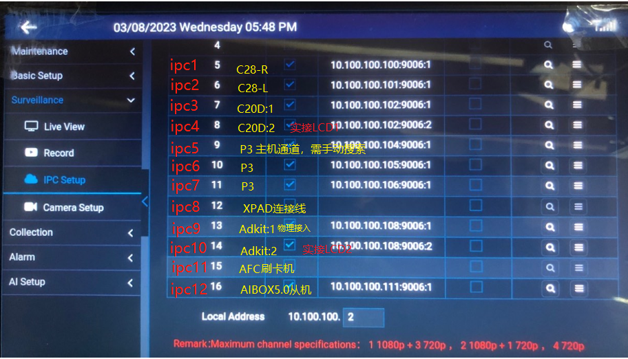


## 3. 软件原理扩展

### 3.1 IPC即插即用配置

系统默认不支持IPC即插即用，需要修改配置文件：

N9M1.0环境：
SYSTEM_CONFIG文件下,新增 "SUPPORT_IPC_PLUG"配置
```
    "FUNCTIONS" : {      
		  "SUPPORT_IPC_PLUG" : "true"
    }
```


